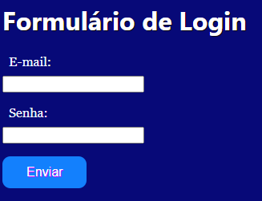

# indice

* [Form Login](#form-Login)
* [Descrição](#descrição)
* [Introdução](#introdução)
* [Funcionalidades](#funcionalidades)
* [Tecnologias Utilizadas](#tecnologias-utilizadas)
* [Fontes Consultadas](#fontes-consultadas)
* [Autores](#autores)

# form-Login

## Descrição 📖
- Este projeto consiste em um formulário de login que solicita ao usuário seu e-mail e senha para autenticação. O formulário foi desenvolvido utilizando HTML e CSS, e possui validação de campos para garantir a correta entrada de dados. Após o preenchimento correto dos campos, o usuário pode realizar o login no sistema.

## Introdução ✉️
- Preenchimento de dados em um formulário de login

## Funcionalidades 🧠
- Aprender a construir formulário de login em HTML5___

## Tecnologias Utilizadas 🖥️   
- Visual Studio Code; 
- CSS3; 
- Github; 
- Git;
- Boot Strap;
- HTML5;

## Fontes Consultadas 🔗
- [boot strap](https://getbootstrap.com/)

## Autores 👥
- [João Pedro Gonçalves](https://github.com/s-pedro13)
- [Nicolas Tonassi](https://github.com/nicolas-tonassi)
